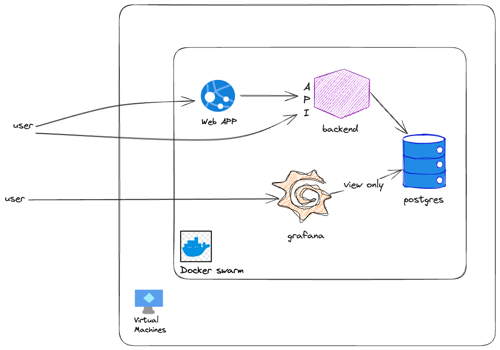

# Expenses Monitor


[](https://github.com/and-mora/expenses-monitor/actions/workflows/trivy.yml)
[](https://github.com/and-mora/expenses-monitor/actions/workflows/build-be.yml)
[](https://github.com/and-mora/expenses-monitor/actions/workflows/cd-pipeline.yml)

### Goal
The idea is to make an application to monitor the personal finance.
I will work on it on best effort.

### Stack


I will experiment Gradle, Spring Webflux.

It's a monorepo containing all the components involved in the application:
- Grafana server for dashboards and alerting
- Backend server in Spring Boot
- Frontend in Angular (overkill of course, but the most known and with materialUI)
- Postgresql database
- Prometheus for monitoring backend
- Microk8s (started with Docker Swarm and upgraded later)



### Devops
The main pipeline is located in `.github/workflows/cd-pipeline.yml` and does the following:
- identify which module (by directory) has changes and find the new version tag according to semantic versioning (each module has a different suffix)
- create tag and GitHub Release
- build the image and deploy

### Security
Form login with session token.

#### Future improvements
- OAuth2.0

## Local deployment (with Docker Swarm)

### Prerequisites
1. Init the swarm if you haven't already:
    ```
    docker swarm init
    ```
2. Create the docker network used by every service:
    ```
    docker network create -d overlay expenses_monitor
    ```
3. Get a TLS certificate, follow [here](docs/tls_certificate.md) if you don't have one.

### Deploy
- the database, see [here](database/README.md)
- grafana server, see [here](monitoring/README.md)
- backend, see [here](backend/README.md)

> **Work In Progress**


