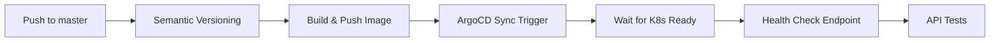

# Migrazione Backend a Deploy ArgoCD - Setup Guide

## 📋 Modifiche Implementate

### 1. ArgoCD Applications
- ✅ Aggiunte app `backend` e `backend-rust` in `manifest/argocd-apps/helm/values.yaml`
- ✅ Configurate per sincronizzare da `manifest/backend/` e `manifest/backend-rust/`

### 2. Nuovi Workflow GitOps
- ✅ `.github/workflows/deploy_backend_argocd.yml` - Deploy backend Java con ArgoCD
- ✅ `.github/workflows/deploy_backend_rust_argocd.yml` - Deploy backend Rust con ArgoCD
- ✅ Workflow hybrid: ArgoCD sync + health check endpoint

### 3. Pipeline CD Aggiornata
- ✅ `cd-pipeline.yml` ora usa i nuovi workflow ArgoCD invece di SSH

## 🔧 Setup Richiesto

### Step 1: Secrets GitHub
Aggiungi questi secrets al repository GitHub (Settings → Secrets and variables → Actions):

```bash
ARGOCD_SERVER=argocd.expmonitor.freeddns.org
ARGOCD_AUTH_TOKEN=<token-from-argocd>
```

**Generare il token ArgoCD**:

Con Keycloak OIDC configurato, hai due opzioni:

```bash
# Opzione A - Login CLI con SSO (uso personale)
argocd login argocd.expmonitor.freeddns.org \
  --sso \
  --grpc-web
# Si apre browser → login Keycloak → token salvato in ~/.argocd/config

# Opzione B - Token dalla UI ArgoCD (per GitHub Actions)
# 1. Apri browser: https://argocd.expmonitor.freeddns.org
# 2. Login con Keycloak (SSO)
# 3. Click sul nome utente (top-right) → "User Info"
# 4. Scroll a "Tokens" section
# 5. Click "Generate New" button
# 6. Nome: "github-actions"
# 7. Expires: "1 year" (o personalizzato)
# 8. Click "Create"
# 9. Copia il token mostrato (SALVALO SUBITO - non sarà più visibile!)

# Opzione C - CLI dopo login SSO
argocd login argocd.expmonitor.freeddns.org --sso --grpc-web
argocd account generate-token --account admin
```

### Step 2: Deploy ArgoCD Apps
Deploy le nuove applicazioni ArgoCD:

```bash
# 1. Commit e push le modifiche
git add manifest/argocd-apps/helm/values.yaml
git commit -m "feat: add backend applications to ArgoCD"
git push origin master

# 2. Aggiorna ArgoCD Apps (trigger automatico o manuale)
kubectl apply -f manifest/argocd-apps/helm/

# Oppure via ArgoCD CLI
argocd app sync argocd-apps
```

### Step 3: Verifica Setup
```bash
# Verifica che le app siano create
argocd app list | grep backend

# Dovrebbe mostrare:
# backend          default    ...
# backend-rust     default    ...

# Check status
argocd app get backend
argocd app get backend-rust
```

### Step 4: Test Primo Deploy
```bash
# Opzione A - Trigger manuale workflow
# GitHub → Actions → "Deploy Backend via ArgoCD" → Run workflow

# Opzione B - Push su backend folder
echo "# test" >> backend/README.md
git commit -am "test: trigger backend deploy"
git push origin master

# Monitora workflow
# GitHub → Actions → "Release and Deploy"
```

## 🎯 Come Funziona

### Deploy Flow (Opzione 4 Hybrid)



**Dettagli**:
1. **ArgoCD Sync**: Workflow triggera sync dell'app `backend`
2. **Wait for Health**: Attende che deployment sia `Synced` + `Healthy` (max 5 min)
3. **Endpoint Check**: Verifica `/actuator/health/readiness` risponda (max 5 min)
4. **API Tests**: Esegue collection Postman solo dopo readiness confermata

### Vantaggi vs SSH Deploy

| Feature | SSH Deploy (Old) | ArgoCD (New) |
|---------|-----------------|--------------|
| GitOps | ❌ | ✅ |
| UI Monitoring | ❌ | ✅ ArgoCD UI |
| Rollback | ⚠️ Manuale | ✅ One-click |
| Drift Detection | ❌ | ✅ Auto-sync |
| Test Readiness | ✅ `kubectl wait` | ✅ ArgoCD wait + curl |
| Audit Trail | ⚠️ Logs | ✅ Git history |

## 🔍 Troubleshooting

### Account 'admin' does not have apiKey capability

**Problema**: Quando provi a generare token dalla UI ArgoCD ottieni:
```
Unable to generate new token: failed to update account with new token: 
account 'admin' does not have apiKey capability
```

**Soluzione GitOps (Consigliata) - Via Helm**:

```yaml
# manifest/argocd/helm/values.yaml
argo-cd:
  configs:
    cm:
      accounts.admin: apiKey, login
      accounts.github-actions: apiKey  # Optional: service account dedicato
    rbac:
      policy.csv: |
        g, ArgoCDAdmins, role:admin
        # Permissions per service account
        p, role:github-actions, applications, *, */*, allow
        g, github-actions, role:github-actions
```

Applica le modifiche:
```bash
# 1. Commit changes
git add manifest/argocd/helm/values.yaml
git commit -m "feat: enable ArgoCD API tokens for admin and CI/CD"
git push origin master

# 2. Aggiorna ArgoCD via Helm
cd manifest/argocd/helm
helm dependency update
helm upgrade argocd . -f values.yaml -n argocd

# 3. Verifica
kubectl get cm argocd-cm -n argocd -o yaml | grep accounts

# Output atteso:
# accounts.admin: apiKey, login
# accounts.github-actions: apiKey
```

**Alternativa Manuale (Non GitOps - Sconsigliata)**:

⚠️ Queste modifiche verranno sovrascritte al prossimo `helm upgrade`

```bash
# Solo per testing/emergenze
kubectl edit configmap argocd-cm -n argocd
# Aggiungi: accounts.admin: apiKey, login
kubectl rollout restart deployment argocd-server -n argocd
```

**Dopo l'applicazione**:

### Login CLI ArgoCD con Keycloak OIDC

**Problema**: `argocd login` con username/password fallisce quando Keycloak OIDC è configurato

**Soluzione**:
```bash
# Usa SSO invece di username/password
argocd login argocd.expmonitor.freeddns.org \
  --sso \
  --grpc-web

# Output atteso:
# Opening browser for authentication
# Authentication successful
```

**Configurazione permanente**:
```bash
# Dopo primo login SSO, puoi usare comandi normalmente
argocd app list
argocd app get backend
argocd app sync backend
```

### Creare Token per Automazione (GitHub Actions)

**Step-by-Step dalla Console ArgoCD**:

1. **Apri ArgoCD UI**: https://argocd.expmonitor.freeddns.org
2. **Login con Keycloak**: Click "Login via Keycloak" → autenticati
3. **Accedi User Settings**:
   - Click sul tuo nome utente (top-right corner)
   - Select "Settings" dal dropdown
4. **Genera Token**:
   - Scroll alla sezione "Tokens"
   - Click button "Generate New Token"
   - **Token Name**: `github-actions`
   - **Expires In**: `1 year` (o personalizza)
   - Click "Generate"
5. **Copia Token**:
   - ⚠️ **IMPORTANTE**: Il token viene mostrato UNA SOLA VOLTA
   - Copia e salva subito in password manager
   - Aggiungi a GitHub Secrets come `ARGOCD_AUTH_TOKEN`

**Alternative con RBAC (Recommended for Production)**:

Se vuoi un service account dedicato invece dell'admin:

```bash
# 1. Crea service account in ArgoCD ConfigMap
kubectl edit configmap argocd-cm -n argocd

# Aggiungi sotto data:
accounts.github-actions: apiKey, login

# 2. Set password/token per il service account
argocd account update-password \
  --account github-actions \
  --current-password <admin-password> \
  --new-password <service-account-password>

# 3. Configura RBAC policy
kubectl edit configmap argocd-rbac-cm -n argocd

# Aggiungi sotto data.policy.csv:
p, role:github-actions, applications, sync, */*, allow
p, role:github-actions, applications, get, */*, allow
g, github-actions, role:github-actions

# 4. Genera token
argocd account generate-token --account github-actions
```

### Test Falliscono Post-Deploy

**Sintomo**: Workflow completa ma test ricevono 502/503

**Debug**:
```bash
# 1. Verifica ArgoCD status
argocd app get backend

# 2. Check pod logs
kubectl logs -n expenses-monitor -l app=backend --tail=100

# 3. Test manuale endpoint
curl -v https://api.expmonitor.freeddns.org/actuator/health/readiness
```

**Fix**: Aumenta timeout in workflow se backend è lento:
```yaml
# deploy_backend_argocd.yml, line 42
--timeout 600  # 10 minuti invece di 5
```

### ArgoCD Sync Resta "Progressing"

**Sintomo**: `argocd app wait` timeout dopo 5 minuti

**Cause comuni**:
1. Image pull failure (credenziali GHCR)
2. Secrets mancanti (db-connection-string, backend-config)
3. Resource limits troppo bassi

**Debug**:
```bash
# Check eventi K8s
kubectl get events -n expenses-monitor --sort-by='.lastTimestamp' | grep backend

# Check pod status
kubectl describe pod -n expenses-monitor -l app=backend
```

### Workflow Fallisce al Health Check

**Sintomo**: ArgoCD sync OK ma curl endpoint fallisce

**Cause**:
1. Ingress non configurato
2. Certificate TLS non pronto
3. Backend non espone porta corretta

**Debug**:
```bash
# Test interno (via port-forward)
kubectl port-forward -n expenses-monitor svc/backend 8080:8080
curl localhost:8080/actuator/health/readiness

# Check ingress
kubectl get ingress -n expenses-monitor backend -o yaml
```

## 📊 Monitoring

### ArgoCD UI
- URL: https://argocd.expmonitor.freeddns.org
- App: `backend`, `backend-rust`
- Monitora sync status, health, events

### GitHub Actions
- Workflow: "Release and Deploy"
- Job logs: `BackendDeployK8s` → `ArgoSync` + `HealthCheck`

### Grafana (opzionale)
```promql
# Backend deployment events
argocd_app_info{name="backend"}

# Sync duration
argocd_app_sync_total{name="backend"}
```

## 🔄 Rollback

### Via ArgoCD UI
1. Apri app `backend` in ArgoCD
2. History → Seleziona versione precedente → Sync

### Via CLI
```bash
# Rollback ultima sync
argocd app rollback backend

# Rollback a revisione specifica
argocd app rollback backend 42
```

### Via Git
```bash
# Revert commit
git revert HEAD
git push origin master

# ArgoCD sincronizza automaticamente alla vecchia versione
```

## 🚀 Prossimi Passi (Opzionali)

### 1. Auto-Sync ArgoCD
Dopo 2 settimane di stabilità, abilita auto-sync:

```yaml
# argocd-apps/helm/values.yaml
applications:
  backend:
    syncPolicy:
      automated:
        prune: true
        selfHeal: true
```

### 2. Rimuovi Workflow SSH
```bash
# Depreca vecchi workflow
git rm .github/workflows/deploy_backend.yml
git rm .github/workflows/deploy_backend_rust.yml
```

### 3. Progressive Delivery
Integra Argo Rollouts per canary deployments:
```yaml
# Sostituisci Deployment con Rollout
kind: Rollout
spec:
  strategy:
    canary:
      steps:
        - setWeight: 20
        - pause: {duration: 2m}
        - setWeight: 50
        - pause: {duration: 5m}
```

## 📞 Support

Issues noti o domande → apri issue su GitHub o consulta:
- [ArgoCD Docs](https://argo-cd.readthedocs.io/)
- [GitHub Actions Docs](https://docs.github.com/en/actions)
