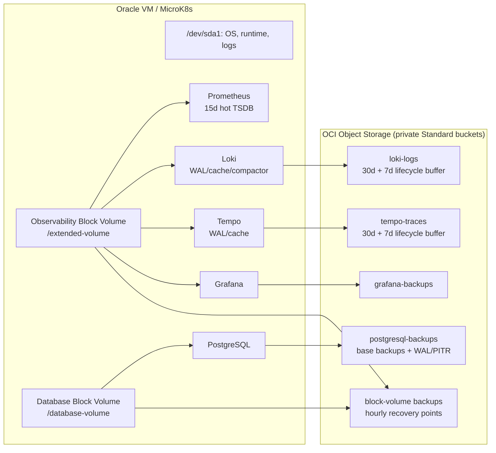

# Storage Allocation Design

## Decision summary

Move logs and traces to OCI Object Storage, retain only their working sets on
OCI Block Volumes, and isolate PostgreSQL on its own Block Volume. Keep
Prometheus on a Block Volume with a 15-day local retention window and use
hourly OCI Block Volume backups for the required one-hour recovery point.

The target for observability data is 30 days for logs and traces, 15 days for
metrics, and no more than one hour of unprotected ingestion data after a VM
failure.

This document is a proposed design. It is not a migration runbook to execute
without testing the staging and rollback steps below.

### Selected Always Free path

Do not use OCI Object Storage for telemetry at this time. The 20 GB combined
Always Free allowance cannot safely accommodate Loki's current 26 GiB local
dataset, Tempo, PostgreSQL backup capacity, lifecycle headroom, and unknown
compressed growth. Keep telemetry on local Block Volume storage with explicitly
bounded retention and capacity alerts.

Object Storage remains a future **Tempo-only** option only after a private,
least-privilege trial proves that the measured compressed growth fits a
reserved budget. A 30-day Loki or Tempo target requires paid Object Storage
approval and a monthly cost guardrail.

The verified Task 0 inventory in
[STORAGE_MIGRATION_EVIDENCE.md](STORAGE_MIGRATION_EVIDENCE.md) supersedes any
conflicting capacity or recovery assumptions in this design. In particular,
the 30-day Object Storage target and hourly Block Volume recovery point are
not approved because the Always Free budget and backup quota do not support
them.

## Measured state

Measurements were captured from the production Oracle VM on 2026-08-11.

| Resource | Size | Used | Free | Finding |
| --- | ---: | ---: | ---: | --- |
| `/dev/sda1` mounted at `/` | 45 GiB | 38 GiB (84%) | 7.7 GiB | Critical OS/runtime capacity risk |
| `/dev/sdb` mounted at `/extended-volume` | 49 GiB | 27 GiB (57%) | 21 GiB | Shared persistence volume |
| Root filesystem inodes | 6.0 M | 6% | 94% | Capacity, not inode, constrained |
| Extended filesystem inodes | 3.3 M | 6% | 94% | Capacity, not inode, constrained |

The root-volume usage is concentrated in `/var`:

| Root location | Measured use | Interpretation |
| --- | ---: | --- |
| `/var/snap` | 21 GiB | 20 GiB is MicroK8s runtime data |
| `/var/lib` | 8.5 GiB | Docker `overlay2` alone is 6.9 GiB |
| `/var/log` | 5.3 GiB | Requires retention and rotation investigation |

The extended volume currently contains:

| PVC path | Measured use | PVC request | Concern |
| --- | ---: | ---: | --- |
| Loki | 26 GiB | 10 GiB | Usage exceeds the declared request; hostpath did not enforce the limit |
| PostgreSQL | 159 MiB | 8 GiB | Correctly stored on the extended volume but shares its failure domain |
| Grafana | 162 MiB | 10 GiB | Correctly stored on the extended volume but shares its failure domain |
| Tempo | 20 KiB | 10 GiB | Local trace storage is not currently carrying material data |
| Prometheus | no live PVC | no request | Uses a 10 GiB, unbounded `emptyDir` TSDB and WAL on the root-backed MicroK8s storage; a pod loss discards it |

Both `extended-hostpath` and `microk8s-hostpath` are marked as default in the
live cluster. A cluster must have only one default StorageClass. All stateful
workloads in this design use an explicit StorageClass, so neither should be
selected accidentally. Both currently use `Delete` reclaim policies and do not
allow volume expansion.

The OCI Console reports a 47 GB boot volume and a 50 GB attached Block Volume,
for 97 GB of the 200 GB Always Free pool before accounting for any other
volumes. Monthly OCI Block Volume backups have failed for months due to quota
exhaustion, so they are not a valid current recovery mechanism.

## Target architecture

### Block volumes and local storage

| Purpose | Proposed OCI Block Volume | Mount / StorageClass | PVC allocation | Reason |
| --- | ---: | --- | ---: | --- |
| OS, MicroK8s runtime, system logs | Expand boot volume to at least 80 GiB | `/` | N/A | Reduces an immediate 83% root-volume risk; target <70% normal use |
| Observability working data | Expand `/dev/sdb` from 49 GiB to 150 GiB | `/extended-volume`, explicit `observability-hostpath` | Prometheus 40 GiB; Loki 10 GiB; Tempo 10 GiB; Grafana 10 GiB; Alertmanager 5 GiB | Provides working space plus migration headroom; object storage removes Loki's 26 GiB primary dataset |
| PostgreSQL | New 50 GiB Block Volume | `/database-volume`, explicit `database-hostpath` | PostgreSQL 40 GiB | Separates business and identity data from noisy telemetry I/O and gives it an independent backup/restore boundary |

These values are capacity allocations, not a license to overcommit hostpath.
MicroK8s hostpath does not reliably enforce the PVC request as a filesystem
quota, demonstrated by Loki using 26 GiB despite a 10 GiB claim. The
underlying Block Volume must therefore have real free-space alerts and enough
headroom for all hosted claims.

Use persistent `/etc/fstab` entries by filesystem UUID with `_netdev,noatime`.
Mount verification must occur before MicroK8s starts. Do not use device names
such as `/dev/sdb` in `fstab`.

Create explicit StorageClasses with `reclaimPolicy: Retain`,
`volumeBindingMode: WaitForFirstConsumer`, and
`allowVolumeExpansion: true`. Remove the default annotation from both existing
hostpath classes, then mark at most one intentionally chosen class as default
for non-stateful workloads. Stateful Helm values must always name their class.

### OCI Object Storage

Use private **Standard** buckets. Standard storage is appropriate because Loki
and Tempo actively query retained data; Archive storage is not suitable for
their primary backends.

| Bucket | Writer | Retention | Lifecycle / controls |
| --- | --- | --- | --- |
| `observability-loki` | Loki S3 backend | 30 days | Delete at 37 days, after Loki compactor has deleted expired blocks |
| `observability-tempo` | Tempo S3 backend | 30 days | Delete at 37 days, after Tempo compaction/deletion |
| `postgresql-backups` | Scheduled PostgreSQL backup job | PITR: daily base backups 35 days; WAL 8 days | Versioning enabled; lifecycle separately scoped for base backups and WAL |
| `grafana-backups` | Scheduled backup job | 35 days | Versioning enabled |
| OCI Block Volume backups | OCI backup policy | hourly recovery points for 48 hours, daily for 14 days | Volume-group policy covering the observability and database volumes |

Use a separate least-privilege OCI IAM principal and Customer Secret Key for
each telemetry backend. Customer Secret Keys must be created outside Terraform
and stored only in Kubernetes Secrets encrypted by Sealed Secrets or an
equivalent secret manager. Never store them in Helm values, Git, or Terraform
state. Bucket policies must scope access to the named bucket only.

The existing Terraform module at
`infrastructure/terraform/oci/observability-object-storage/` is a starting
point for Tempo. It needs separate buckets, principals, policies, lifecycle
rules, and backup-bucket versioning before this design is applied.

### Service placement and retention

| Service | Primary data location | Local persistent data | Retention | Recovery approach |
| --- | --- | --- | --- | --- |
| PostgreSQL and Keycloak data | `/database-volume` | PostgreSQL data only | Application-defined | Daily base backup plus continuous WAL archive; restore test required |
| Grafana | `/extended-volume` | SQLite/runtime state | N/A | Provision dashboards from Git; back up runtime state daily |
| Prometheus | `/extended-volume` | 15-day TSDB and WAL, 40 GiB PVC | 15 days | Hourly Block Volume backups; restore one-hour-or-newer point |
| Loki | OCI Object Storage | 10 GiB WAL, cache, compactor workdir | 30 days | Recreate pod and query OCI data; volume backup covers unshipped work |
| Tempo | OCI Object Storage | 10 GiB WAL/cache | 30 days | Recreate pod and query OCI data; volume backup covers unshipped work |
| Alertmanager | `/extended-volume` | 5 GiB state PVC | Policy-defined | Preserve silences and notification state in volume backups |
| Argo CD Redis | ephemeral | none | N/A | Rebuildable cache; do not allocate durable storage unless requirements change |

Prometheus cannot write its native TSDB directly to OCI Object Storage.
Prometheus blocks can be shipped by Thanos, but normal block shipping occurs
after block completion and cannot meet a one-hour RPO on its own. The selected
design keeps a bounded 15-day local TSDB and protects it with hourly OCI Block
Volume backups. Add Thanos only if long-term metrics retention or globally
queryable historical metrics becomes a requirement.

## Required configuration changes

1. **Root pressure:** investigate the 20 GiB MicroK8s runtime directory and
   5.3 GiB `/var/log` before deleting anything. Enable bounded kubelet/container
   log rotation and remove only verified unused container images or snapshots.
   Do not manually remove files under MicroK8s or container-runtime data
   directories. Expand the boot volume before the remaining 7.8 GiB is
   exhausted.
2. **PostgreSQL:** add explicit persistence class, size, access mode, backup
   schedule, WAL archiving, and restore documentation to
   `manifest/postgresql/values.yaml`. Migrate with a tested logical backup and
   restore; do not move the hostpath directory while PostgreSQL is running.
3. **Grafana and Alertmanager:** explicitly configure persistence class and
   size in `manifest/monitoring/values.yaml`, then back up their runtime state.
4. **Prometheus:** reconcile why the expected PVC is absent from the live
   cluster. Confirm the rendered Helm release, current `prometheusSpec`, and
   its actual TSDB path before enabling the 40 GiB PVC and changing retention
   from 7 to 15 days.
5. **Loki:** change from `filesystem` to Loki's S3/OCI Object Storage backend,
   with TSDB index, chunks, ruler data, and compactor delete-request store in
   the bucket. Keep a local WAL and compactor working directory. Configure
   `retention_period: 720h` and compactor retention deletion. The OCI lifecycle
   buffer must remain longer than the Loki retention.
6. **Tempo:** use the already prepared OCI S3-compatible configuration in
   `manifest/tempo/values.yaml`, set the S3 backend, set
   `TEMPO_RETENTION=720h`, and retain a local 10 GiB WAL/cache PVC.
7. **Backups and monitoring:** create OCI volume-backup policies and alerts for
   backup age/failure, filesystem free space, filesystem inodes, Loki/Tempo
   object-store errors, PostgreSQL WAL archive failures, and PVC usage.

## Migration sequence and rollback

1. Take a verified PostgreSQL logical backup, Grafana backup, and OCI Block
   Volume backup. Record the current PVC-to-host-path mapping.
2. Expand the boot and observability volumes, attach and mount the new database
   volume, and validate persistent mounts after a controlled reboot.
3. Deploy the new explicit StorageClasses without changing any live claim.
4. Create OCI buckets, IAM policies, Customer Secret Keys, and Kubernetes
   Secrets. Test upload, read, and delete permissions using a non-production
   prefix.
5. Move Tempo to OCI Object Storage first. Verify ingestion, TraceQL queries,
   compaction, retention deletion, and restart recovery. Keep the old PVC
   unchanged for at least 30 days.
6. Move Loki to OCI Object Storage. Verify ingestion, historical queries,
   ruler behavior, compaction, deletion, and restart recovery. Keep the old
   filesystem data until the 30-day OCI retention window is complete.
7. Migrate PostgreSQL to the dedicated volume by restoring the verified backup,
   switch the service during a maintenance window, and perform an application
   and Keycloak login check before retiring the old claim.
8. Reconcile and migrate Prometheus, Grafana, and Alertmanager claims. Enable
   hourly volume backups only after an isolated restore has succeeded.
9. Review measured growth after 7 and 30 days. Resize volumes or retention
   deliberately; do not rely on hostpath PVC requests as quotas.

For Loki and Tempo, rollback means restoring the previous Helm values and
reusing the untouched local PVC. For PostgreSQL, rollback means stopping the
new instance and returning to the old claim only while it remains the last
writer; never allow two PostgreSQL instances to write the same database.

## Acceptance criteria

- Root filesystem remains below 70% normal use and alerts at 70%/80%.
- Observability and database volumes remain below 70% normal use and alert at
  70%/80%; inode alerts trigger at 70%/80%.
- Exactly one StorageClass is default, and every stateful service names its
  StorageClass.
- Loki and Tempo successfully ingest, query, compact, and delete 30-day data
  from OCI Object Storage.
- A VM-loss drill restores PostgreSQL, Grafana, Prometheus, Loki, and Tempo
  with no more than one hour of unprotected ingestion data.
- PostgreSQL PITR and a volume-backup restore are each tested at least
  quarterly.
