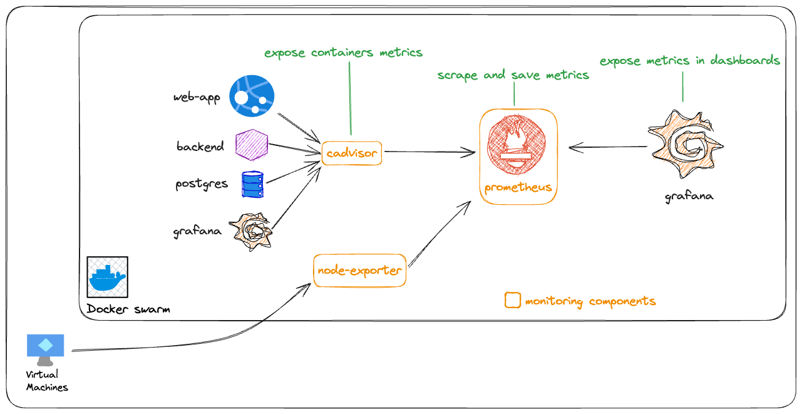

# Architecture

There are 3 components in the architecture:
- Prometheus backend: scrape and save metrics to allow dashboarding
- node-exporter: responsible to expose the node metrics
- cadvisor: responsible to expose the container metrics

